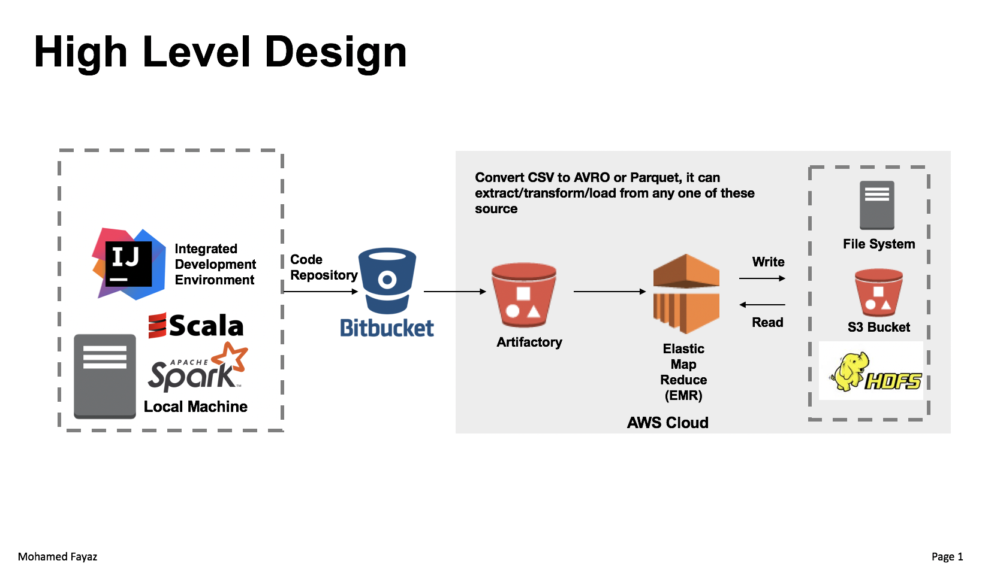

<p>
  <a href="https://twitter.com/intent/follow?screen_name=FayazMohamedd"></a>
<br />
</p>

# File Converter using Apache Spark

The File Converter application is a Spark Scala application developed for the purpose of an interview. The application is highly scalable, fault tolerant and tested in running multi-node cluster.

## Getting Started

The current repository has the Scala code with the attached unit test using ScalaTest framework. To run this application, please copy the JAR file from target/scala-2.11/converter-assembly-0.1.jar to the cluster or s3 and run the spark submit command as given below:

```sh

spark-submit --class au.fayaz.Converter converter-assembly-0.1.jar \
/inputFiles/sample.csv \
/outpuFiles/20190524/ \
parquet
```
<p align="center">
  
</p>

### Prerequisites

To run in local, git clone this repository and install the below applications

```
Scala 2.11.12
Spark 2.12.x +
SBT 1.2.1
Java 1.8
IntelliJ
```


## Running the tests

In the sbt shell or in terminal (if you have SBT installed)

### Unit Test 

```
sbt test
```

The test data is stored in the resource folder under test. Currently, there are four test cases such as: 

- [X] The first test case is to instantiate the spark session
- [X] Tests the read CSV functionality 
- [X] Tests the write AVRO functionality
- [X] Tests the write Parquet functionality  

### Build and package 

```
sbt assembly
```

## Deployment

To deploy in AWS, we just need to copy the JAR into the S3 bucket with input files. And can run the application from EMR. 


## Built With

* [SBT](https://www.scala-sbt.org/) - Build and Dependency Management Tool
* [ScalaTest](http://www.scalatest.org/) - Unit testing framework 

## Author

* **Mohamed Fayaz** 


